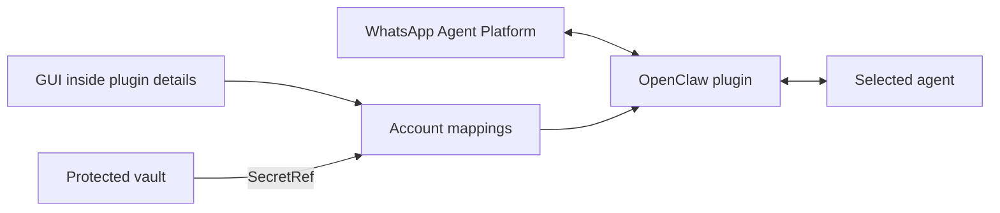

# WhatsApp Agent Platform — OpenClaw GUI

**Connect WhatsApp Agent Platform accounts to your OpenClaw agents and manage
account mappings through a graphical interface.**

Open **Settings → Channels → WhatsApp Agent Platform**. The account manager
appears only inside the selected plugin, not on the Channels overview.

[Download v0.8.1](https://github.com/localxcrm/openclaw-whatsapp-agent-platform/releases/tag/v0.8.1)
· [Setup and usage guide](docs/CONFIGURATION.md)
· [Installation and rollback](distribution/INSTALL.md)

## What the GUI does

| Action | Result |
| --- | --- |
| **+ Add agent** | Maps a WhatsApp account to an existing OpenClaw agent. |
| **Select an API** | Uses a protected vault reference without displaying the credential. |
| **Save mapping** | Changes the assigned agent, session mode, or enabled state. |
| **Remove mapping** | Removes the plugin account while preserving the agent, history, and vault secret. |
| **List agents** | Shows agents available in your own installation; no accounts are preconfigured. |



## Quick start

1. Install OpenClaw **2026.9.3** and configure at least one agent.
2. Obtain access to WhatsApp Agent Platform and its account credential.
3. Download and extract the complete ZIP from **Releases**.
4. Run `node install.mjs /path/to/node_modules/openclaw --check`, then run the
   same command without `--check`.
5. Enable the plugin, set `transport: "channel"`, and configure its `accounts` map.
6. Restart the Gateway and open **Settings → Channels → WhatsApp Agent Platform**.
7. Click **+ Add agent**, select an existing agent and an API saved in the vault.

Read the [complete guide](docs/CONFIGURATION.md) for fresh and existing
installations, protected credential entry, message testing, and troubleshooting.

## Compatibility and scope

- **GUI:** a version-specific host adaptation for **OpenClaw 2026.9.3**, requiring
  Node.js 24+. This is not an official Channels extension slot. OpenClaw updates
  may require changes; the installer rejects incompatible versions and layouts.
- **Plugin:** TypeScript source, channel ID `whatsapp-agent`, internal plugin ID
  `whatsapp-agent-admin`. A legacy transport remains available for compatibility.
- **Complete distribution:** plugin plus GUI installer. Installing only the `.tgz`
  does not integrate the Channels screen. No npm publication is assumed.
- Receives text, audio, images, stickers, video, and documents; sends text, audio,
  and video. Media understanding depends on configured OpenClaw providers.
- Does not create OpenClaw or Meta agents, implement WhatsApp Web QR pairing,
  manage groups, or send outgoing images/documents in this version.
- The optional legacy Control UI extension remains in the source. It is not
  required for the Channels flow and depends on experimental host settings.
- Plugin-owned labels, messages, and documentation are in English. OpenClaw's
  own interface language and the language of agent replies are separate settings.

## WhatsApp and OpenClaw references

- [WhatsApp — official website](https://www.whatsapp.com/)
- [WhatsApp — third-party agents](https://www.whatsapp.com/legal/third-party-agents-terms)
- [WhatsApp Plus — official page](https://www.whatsapp.com/whatsapp-plus)
- [OpenClaw — channel plugin SDK](https://docs.openclaw.ai/plugins/sdk-channel-plugins)

The code uses `https://api.whatsapp.com/agent/v1`. A public credential-issuance
portal for Agent Platform has not been verified; follow the official onboarding
available to your account. WhatsApp Plus is not presented as an API credential
portal. This is an independent project, not an official Meta/WhatsApp product.
References checked on September 14, 2026.

## Development

```sh
npm ci
npm run validate
npm run build
npm run build:ui
npm run build:channels-ui
```

`npm run validate` runs type checking and 38 unit tests. Prebuilt distribution
assets are in `distribution/`; releases provide a ready-to-install ZIP. Tests
cover configuration, channel registration, deduplication, delivery, media,
protected references, and account mapping mutations.

The browser fixture in `test/channels-settings.browser.mjs` exercises the English
GUI with synthetic accounts and RPCs. It requires `playwright-core` and a Chrome
executable supplied through `CHROME_EXECUTABLE_PATH`. It never connects to the
production Gateway.

The original integration was tested with a warm browser cache and approved on
the original installation. Its installer was tested on an isolated host copy.
These checks do not imply successful real-message delivery in every environment.

### Known clean-build limitation

On September 14, 2026, `npm ci` failed with `ETARGET`: the transitive dependency
`iconv-lite@~0.8.0` was unavailable in the registry. Local type checking, builds,
and tests used dependencies already available in the development environment.
No green CI or reproducible clean build is claimed. For installation and use,
prefer the prebuilt release ZIP, which does not require compiling this repository.

## Data and credentials

No real accounts, credentials, conversations, or private backups are included.
Enter tokens only through protected vault fields. The plugin stores polling
state and media on the host. Do not run two consumers with the same API token.
Removing a mapping does not delete its secret or history. Public bug reports
must not include keys, conversations, or complete configuration files.

## License

[MIT](LICENSE). Copyright 2026 Pro House Painters.
