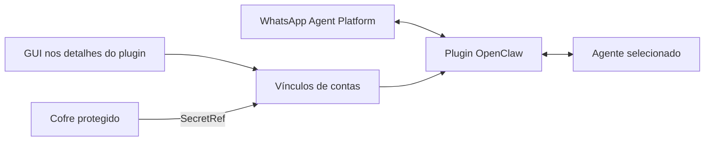

# WhatsApp Agent Platform — OpenClaw GUI

**Conecte contas do WhatsApp Agent Platform aos seus agentes OpenClaw e gerencie
os vínculos por uma interface visual.**

Acesse **Settings → Channels → WhatsApp Agent Platform**: o gerenciamento aparece
somente ao abrir o plugin, não como formulário na lista geral de canais.

[Baixar versão 0.8.0](https://github.com/localxcrm/openclaw-whatsapp-agent-platform/releases/tag/v0.8.0)
· [Como configurar e usar](docs/CONFIGURATION.md)
· [Instalação e recuperação](distribution/INSTALL.md)

## O que a GUI faz

| Ação | Resultado |
| --- | --- |
| **+ Adicionar agente** | Cria um vínculo entre uma conta WhatsApp e um agente já existente no OpenClaw. |
| **Selecionar API** | Usa uma referência do cofre protegido, sem exibir a credencial. |
| **Salvar vínculo** | Troca o agente responsável, modo de sessão ou estado ativo. |
| **Remover vínculo** | Remove a conta do plugin, preservando agente, histórico e segredo. |
| **Listar agentes** | Mostra os agentes disponíveis naquela instalação, sem contas pré-cadastradas. |



## Começo rápido

1. Instale OpenClaw **2026.9.3** e configure pelo menos um agente.
2. Tenha acesso ao WhatsApp Agent Platform e à credencial correspondente.
3. Baixe e extraia o ZIP em **Releases**.
4. Execute `node install.mjs /caminho/para/node_modules/openclaw --check`, depois
   o mesmo comando sem `--check`.
5. Habilite o plugin com `transport: "channel"` e configure o mapa `accounts`.
6. Reinicie o Gateway e abra **Settings → Channels → WhatsApp Agent Platform**.
7. Use **+ Adicionar agente**, selecione o agente e a API salva no cofre.

Veja o [passo a passo completo](docs/CONFIGURATION.md), incluindo instalação nova,
instalação existente, cofre, teste de mensagem e solução de problemas.

## Compatibilidade e escopo

- **GUI:** adaptação versionada do host **OpenClaw 2026.9.3**, com Node.js 24+.
  Não é um slot oficial de extensão da tela Channels; atualizações do OpenClaw
  podem exigir adaptação. O instalador recusa versões/layouts incompatíveis.
- **Plugin:** código TypeScript, canal `whatsapp-agent`, ID interno
  `whatsapp-agent-admin`. O transporte também tem modo legado para compatibilidade.
- **Distribuição completa:** plugin + instalador da GUI. Instalar apenas o `.tgz`
  não integra a tela. Não há publicação npm presumida.
- Recebe texto, áudio, imagens, stickers, vídeo e documentos; envia texto, áudio
  e vídeo. Interpretação de mídia depende dos provedores configurados no OpenClaw.
- Não cria agentes OpenClaw ou Meta, não é WhatsApp Web por QR, não implementa
  grupos, nem envia imagens/documentos de saída nesta versão.
- A extensão Control UI legada opcional continua no código, mas não é necessária
  para o fluxo em Channels e depende das opções experimentais do host.

## Referências do WhatsApp e OpenClaw

- [WhatsApp — site oficial](https://www.whatsapp.com/)
- [WhatsApp — agentes de terceiros](https://www.whatsapp.com/legal/third-party-agents-terms)
- [WhatsApp Plus — página oficial](https://www.whatsapp.com/whatsapp-plus)
- [OpenClaw — SDK de plugins de canais](https://docs.openclaw.ai/plugins/sdk-channel-plugins)

O código usa a API `https://api.whatsapp.com/agent/v1`. O link público do portal
para emitir a credencial Agent Platform não foi confirmado; siga o onboarding
oficial disponível na sua conta. WhatsApp Plus não é apresentado aqui como um
portal de emissão de API. Projeto independente, não oficial da Meta/WhatsApp.
Referências consultadas em 14/09/2026.

## Desenvolvimento

```sh
npm ci
npm run validate
npm run build
npm run build:ui
npm run build:channels-ui
```

`npm run validate` executa tipagem e 38 testes unitários. Os artefatos de distribuição
aprovados estão em `distribution/`; a release contém o ZIP pronto para instalar.
Os testes cobrem configuração, registro de canal, deduplicação, envio, mídia,
referências protegidas e mutações de vínculos.

A GUI foi testada em navegador com dados fictícios e cache antigo, e aprovada na
instalação original. O instalador foi testado em cópia isolada do host. Isso não
significa teste de troca real de mensagens em todos os ambientes.

### Limitação conhecida do build limpo

Em 14/09/2026, `npm ci` falhou com `ETARGET`: a dependência transitiva
`iconv-lite@~0.8.0` não foi encontrada no registro. Tipagem, build e testes locais
usaram as dependências já disponíveis no ambiente de desenvolvimento. Não há
alegação de CI ou build limpo reproduzível. Para instalar e usar, prefira o ZIP
pré-compilado da release, que não exige compilar o código deste repositório.

## Dados e credenciais

Nenhuma conta real, credencial, conversa ou backup privado acompanha o projeto.
Tokens entram somente no cofre protegido. O plugin mantém estado de polling e
mídia no host. Não execute dois consumidores com a mesma API. Remover um vínculo
não apaga o segredo nem o histórico. Relatos públicos de bugs não devem incluir
chaves, conversas ou arquivos completos de configuração.

## Licença

[MIT](LICENSE). Copyright 2026 Pro House Painters.
